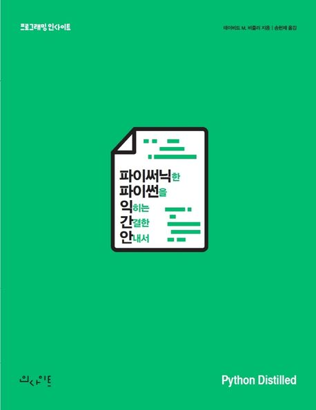

# python-distilled-example

[Python Distilled](https://product.kyobobook.co.kr/detail/S000002277026)(저자 David M. Beazley)를 번역한   
[파이써닉한 파이썬을 익히는 간결한 안내서](https://product.kyobobook.co.kr/detail/S000061584147) (번역 송현제)의 도서를 읽고 공부 겸  
저장을 하기 위해 만든 Repository입니다.

1장씩 완벽하게 스크립트 및 나만의 이해를 쓰면 가장 좋지만,  
제가아는 저는, 이걸 작성하는 기간이 길어지면 흐지부지 될 것을 알기에 일단  
빠른 완주를 위해 10장까지의 읽은 후 맞춤법이나 띄어쓰기와 문장의 교정을 할 예정입니다.  
그 전까지는 맞춤법이나 띄어쓰기가 많이 틀릴 수 있어 미리 양해를 구하는 바  
열심히 읽어서 완주한 번 해보겠습니다 😎

## Index Timeline 
- [ ] 1 - 파이썬 기초 | 05.13 ~
- [ ] 2 - 연산자, 표현식, 데이터 조작
- [ ] 3 - 프로그램 구조와 제어 흐름
- [ ] 4 - 객체, 타입, 프로토콜
- [ ] 5 - 함수
- [ ] 6 - 제너레이터
- [ ] 7 - 클래스와 객체지향 프로그래밍
- [ ] 8 - 모듈과 패키지
- [ ] 9 - 입력과 출력
- [ ] 10 - 내장 함수와 표준 라이브러리

## 나중에 Question
- 40p 각주 `하위 호완성`